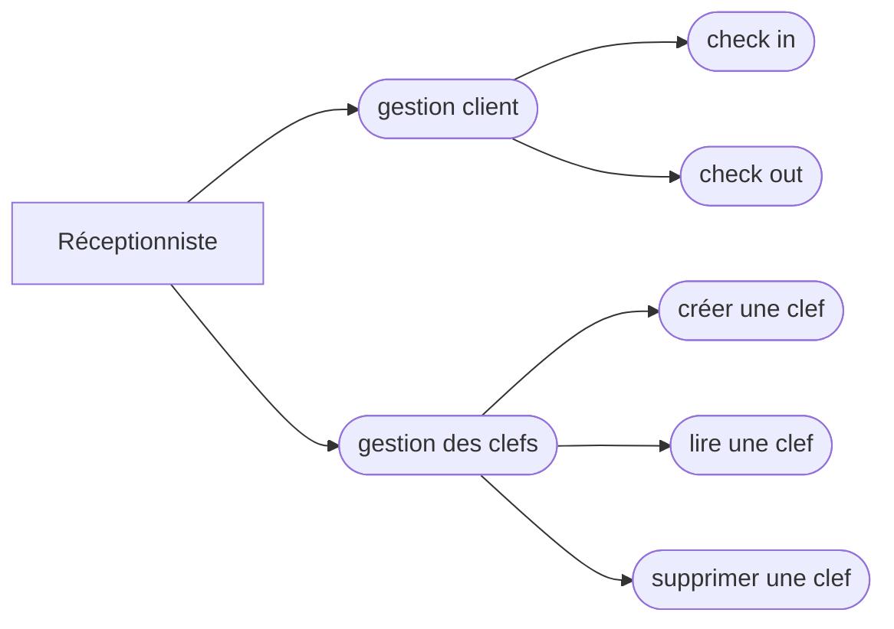
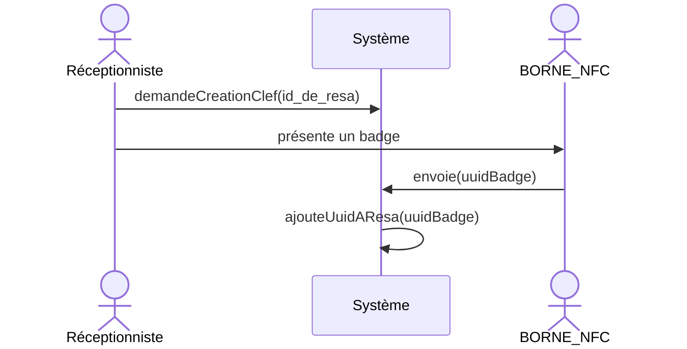
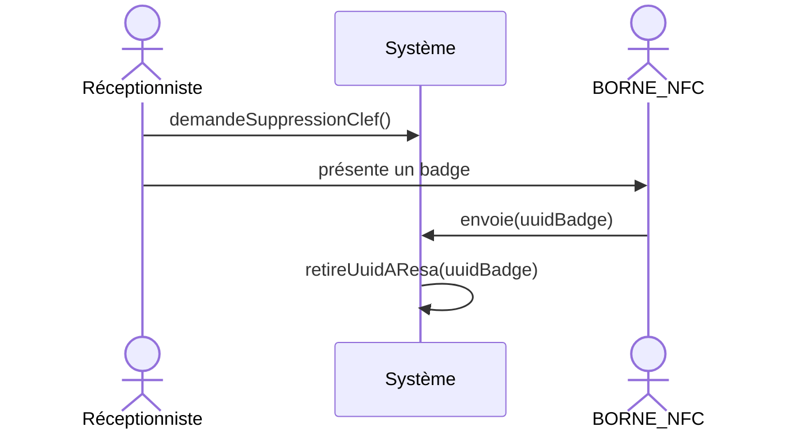

CAS D'UTILISATION DU RÉCEPTIONNISTE

```mermaid
flowchart LR
    Réceptionniste --> id1([gestion client])
    id1 --> id11([check in])
    id1 --> id12([check out])
    Réceptionniste --> id2([gestion des clefs])
    id2 --> id3([créer une clef])
    id2 --> id4([lire une clef])
    id2 --> id6([supprimer une clef])
```

DIAGRAMME DE SEQUENCE : RÉCEPTIONNISTE CRÉÉ UNE CLEF (BORNE_NFC NFC)

```mermaid
sequenceDiagram
    actor Réceptionniste
    Réceptionniste->>Système: demandeCreationClef(id_de_resa)
    actor BORNE_NFC
    Réceptionniste->>BORNE_NFC: présente un badge
    BORNE_NFC->>Système: envoie(uuidBadge)
    Système->>Système: ajouteUuidAResa(uuidBadge)
```

DIAGRAMME DE SEQUENCE : RÉCEPTIONNISTE SUPPRIME UNE CLEF

```mermaid
sequenceDiagram
    actor Réceptionniste
    Réceptionniste->>Système: demandeSuppressionClef()
    actor BORNE_NFC
    Réceptionniste->>BORNE_NFC: présente un badge
    BORNE_NFC->>Système: envoie(uuidBadge)
    Système->>Système: retireUuidAResa(uuidBadge)
```