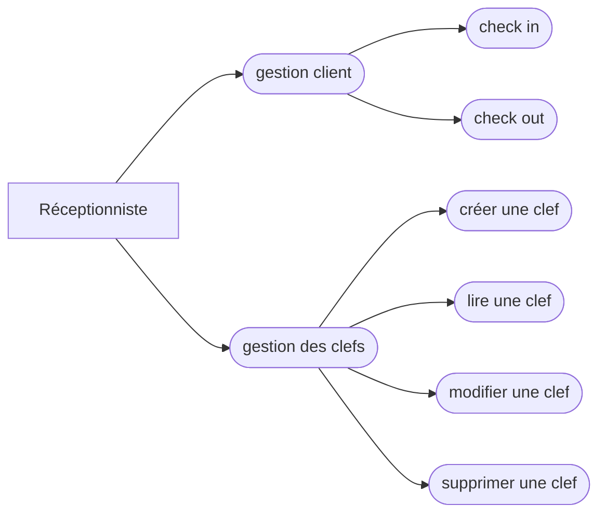
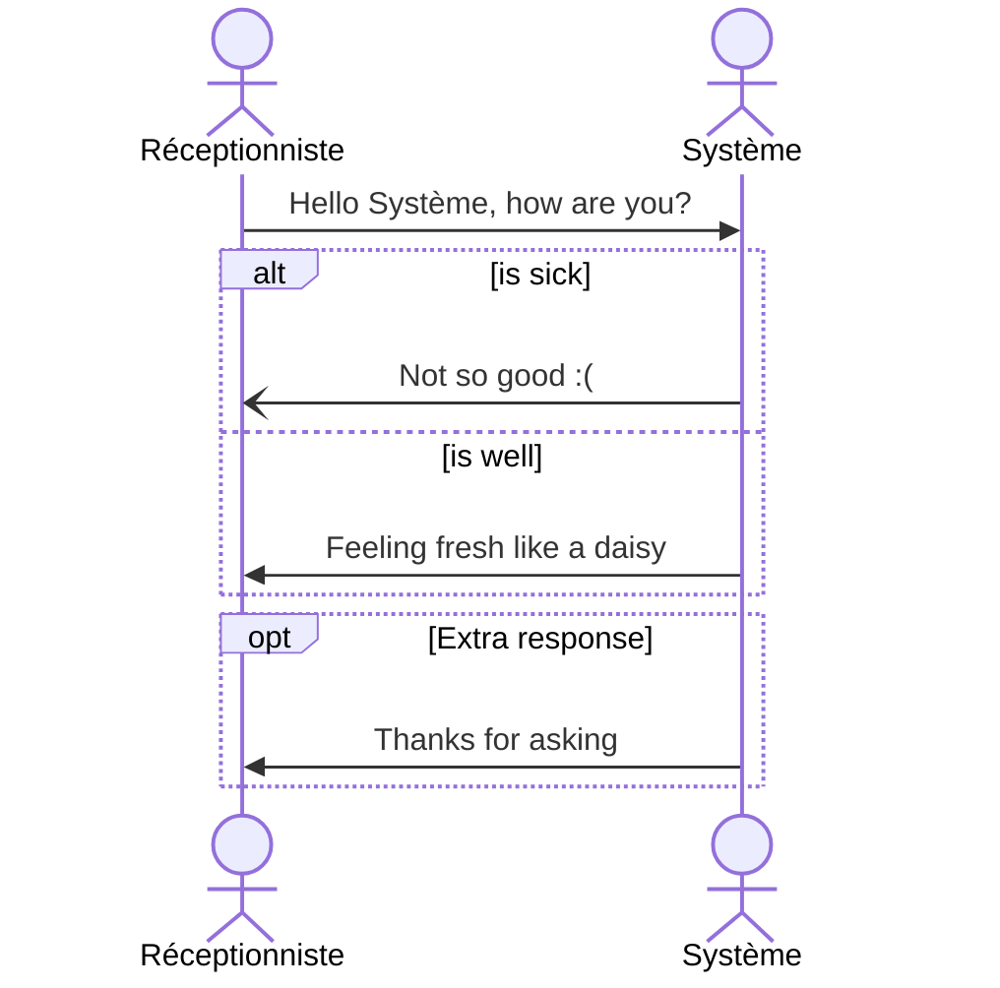

CAS D'UTILISATION DU RÉCEPTIONNISTE

```mermaid
flowchart LR
    Réceptionniste --> id1([gestion client])
    id1 --> id11([check in])
    id1 --> id12([check out])
    Réceptionniste --> id2([gestion des clefs])
    id2 --> id3([créer une clef])
    id2 --> id4([lire une clef])
    id2 --> id5([modifier une clef])
    id2 --> id6([supprimer une clef])
```

DIAGRAMME DE SEQUENCE : RÉCEPTIONNISTE CRÉÉ UN BADGE NFC

```mermaid
sequenceDiagram
    actor Réceptionniste
    actor Système
        Réceptionniste->>Système: Hello Système, how are you?
        alt is sick
            Système-)Réceptionniste: Not so good :(
        else is well
            Système->>Réceptionniste: Feeling fresh like a daisy
        end
    
        opt Extra response
            Système->>Réceptionniste: Thanks for asking
        end


```